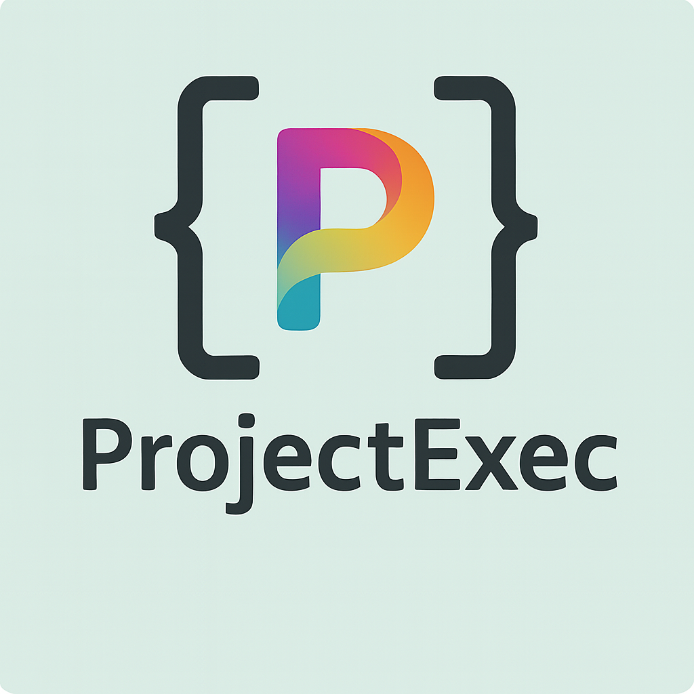

# Project Exec

- [BlenderExec](https://github.com/MCUnderground/BlenderExec) – VS Code extension for Blender script development.
- [KritaExec](https://github.com/MCUnderground/KritaExec) – VS Code extension for Krita plugin development.
- [MaxExec](https://github.com/MCUnderground/MaxExec) – VS Code extension for MaxScript language support and development.

